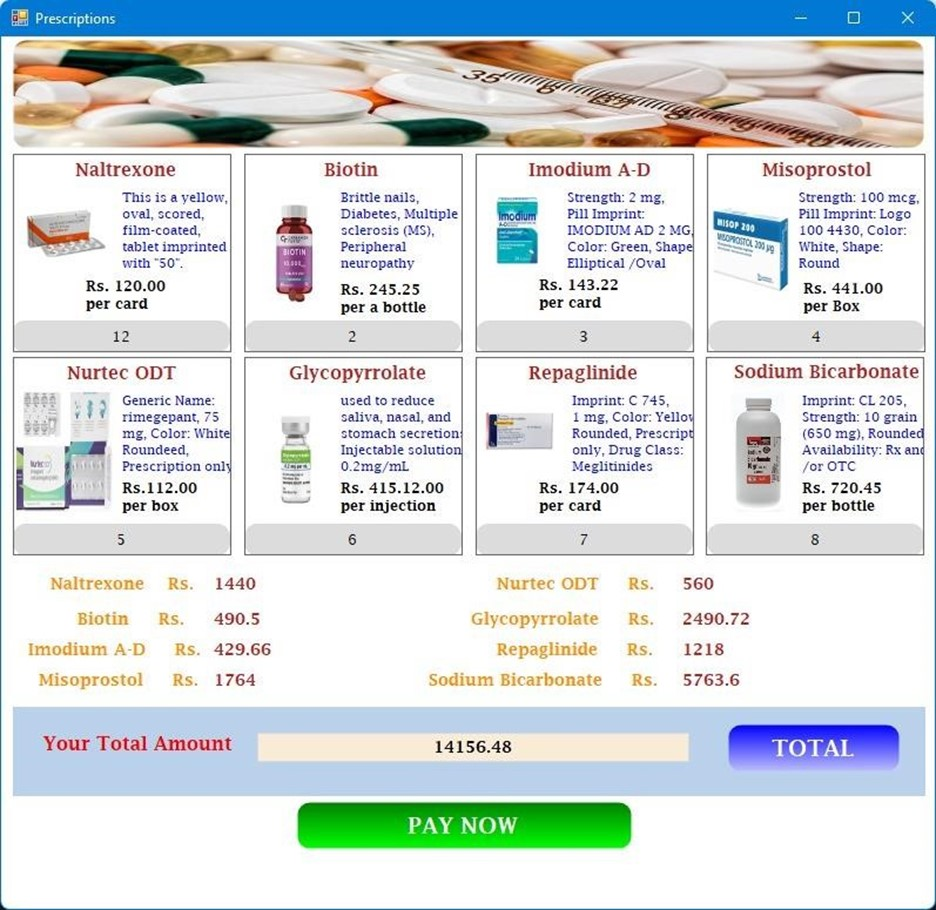

# Hospital Management System


## About The Project
We developed this software to make the work in a hospital more efficient. And to manage the hospital. We used C # language to create this software and the .NET framework and Guna UI framework. This software has 7 primary user interfaces. These interfaces allow you to enter and manage the details of the doctors, manage the records of the patients, make appointments to see a doctor, manage hospital rooms, pay hospital fees, and manage the hospital's pharmacy. A lot can be done.

### Built With
* [C#](https://docs.microsoft.com/en-us/dotnet/csharp/)
* [.NET Framework](https://dotnet.microsoft.com/)
* [Guna UI Framework](https://gunaframework.com/)
* [SQL Server](https://www.microsoft.com/en-us/sql-server/sql-server-downloads)

## Getting Started
To get a local copy up and running follow these simple steps.

### Prerequisites
* Visual Studio 2019
* SQL Server 2019

### Installation
1. Clone the repo
   ```sh
   git clone https://github.com/ravindu0823/C-Sharp-Group-Project.git
    ```
2. Open the project in Visual Studio
3. Open the SQL Server and run the SQL script in the SQL folder
4. Change the connection string in the App.config file
5. Run the project

## Usage
### Login


### Sign Up


### Forgot Password


### Dashboard


### Appointments


### Billing


### Doctors


### Rooms


### History


### Patients


### Pharmacy


### Medicine Details


### Office


### Prescription
